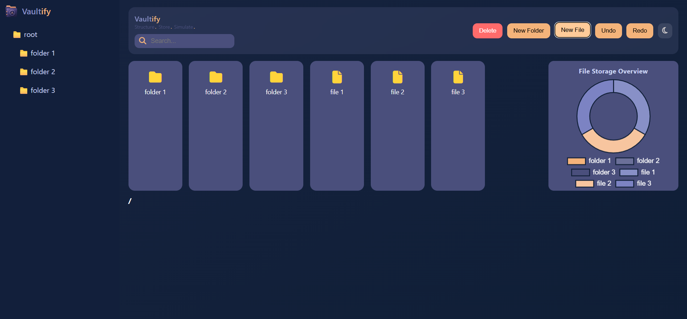

# 🗂️ Vaultify

### ✨ Structure. Store. Simulate.

Vaultify is an interactive **File System Simulator** that combines a modern web-based UI with a robust **Data Structures–driven backend model**.  
It mimics real-world file system operations while visualizing storage usage and hierarchy.

---

## 🌐 Live Demo
🔗 [https://IshaanMig2507.github.io/vaultify/](https://ishaanmig2507.github.io/Vaultify/)

---

## 📸 Preview

---

## 🚀 Features

### 📁 File System Operations
- Create folders and files
- Delete and rename items
- Navigate directory structure
- Hierarchical tree-based representation

### 🔁 State Management
- Undo / Redo functionality using stacks
- Persistent storage using `localStorage`

### 🔍 Search
- Real-time filtering of files and folders

### 📊 Visualization
- Storage distribution using **Chart.js**
- Dynamic updates based on file structure

### 🖱️ UX Enhancements
- Custom right-click context menu
- Smooth animations and transitions
- Dark mode support 🌙

---

## 🧠 DSA Implementation (C++ Backend Model)

Vaultify is backed by a **tree-based file system design**, implemented in C++ (`fileSystem.cpp`), demonstrating strong DSA concepts:

### Core Concepts Used:
- 🌳 **Tree (N-ary Tree)** for directory structure
- 🔁 **Stacks** for Undo/Redo operations
- 🗺️ **Hash Maps (`unordered_map`)** for fast lookup
- 🔍 **DFS Traversal** for search and size calculation

---

### ⚙️ Supported Commands

bash
mkdir <path>       # Create directories
touch <name> <size>  # Create file
ls                 # List contents
cd <path>          # Change directory
pwd                # Print current path
du                 # Disk usage
find <name>        # Search files/folders
rm <name>          # Delete node
undo / redo        # Undo/Redo operations
save <file>        # Save state
load <file>        # Load state

## 🛠 Tech Stack

### 🎨 Frontend
- HTML  
- CSS *(Custom UI + Glassmorphism)*  
- JavaScript *(Vanilla JS)*  
- Chart.js  

### 🧠 Backend Logic (DSA Model)
- C++  
- STL *(stack, unordered_map, recursion)*  

---

## 📂 Project Structure
Vaultify/
│
├── index.html
├── style.css
├── script.js
├── logo.png
├── fileSystem.cpp # DSA implementation
└── README.md

---

## 💡 Key Highlights

- Combines **UI + DSA concepts** in one project  
- Real-world simulation of file system behavior  
- Clean, modern, product-like interface  
- Strong demonstration of **system design thinking**  

---

## 👩‍💻 Author

**Jahnvee Srivastava**  
B.Tech CSE | DTU  

---

## ⭐ If you like this project

Give it a ⭐ on GitHub and share your feedback!
